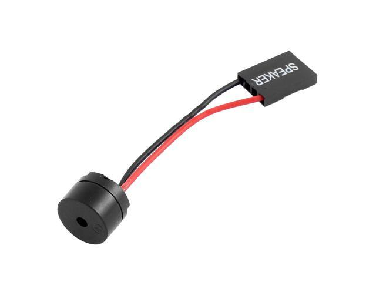

# TinyRTTTL - Arduino RTTTL Song Player # 
[](https://www.ardu-badge.com/TinyRTTTL)
[](https://travis-ci.com/jasonacox/TinyRTTTL)

Arduino Library to play RTTTL Songs on Speaker

## Description
This is an Arduino library to decode and play RTTTL (RingTone Text Transfer Language) songs via the tone() function. Works well with tiny piezo speakers. 

Ring Tone Text Transfer Language (RTTTL) was developed by Nokia to define ringtones to be used on their cellphones (see [Wikipedia](https://en.wikipedia.org/wiki/Ring_Tone_Transfer_Language)).  The format made it easy for people to create their favorite songs as ringtones. There are many song and tools for RTTTL available online. This library makes it easy for you to import and use those tunes in your Arduino projects.

Sample RTTTL Song
```
    fifth:d=4,o=5,b=63:8g5,32p,8g5,32p,8g5,2d#5
```

This library also runs well on the Arduino Uno, ESP8266 and tiny controllers like the ATtiny85.

## Hardware
This library is designed to use the Arduino built in tone() function to play the notes on an attached piezo speaker (see [here](https://create.arduino.cc/projecthub/SURYATEJA/use-a-buzzer-module-piezo-speaker-using-arduino-uno-89df45)).

[](speaker.jpg)

* PC Internal Speaker Buzzer - https://smile.amazon.com/gp/product/B01MR1A4NV/ref=ppx_yo_dt_b_search_asin_title?ie=UTF8&psc=1

## Installation
Install this manually by cloning this repo into your Arduino library folder (e.g. `~/Documents/Arduino/libraries`).  

## Usage
The library provides a single class named TM1637TinyDisplay with the following functions:

* `play` - Play song by passing RTTTL string to function
* `play_P` - PROGMEM function of the above to keep data in Flash instead of being loaded in to SRAM to save memory. 

## Example Code
```cpp
#include <Arduino.h>
#include <TinyRTTTL.h>

// Define Location of Speaker - Pin
#define SPEAKER 4

// Define Octive Offset
#define OCTIVE 0

// Initialize TM1637TinyDisplay
TinyRTTTL rtttl(SPEAKER, OCTIVE);

// Sample song to play in RTTTL format
char *song = "fifth:d=4,o=5,b=63:8g5,32p,8g5,32p,8g5,2d#5";

void setup() {
  rtttl.play(song);
}

void loop() {
  delay(1000);
}
```

## References and Credit
* RTTTL Format Specification - http://merwin.bespin.org/t4a/specs/nokia_rtttl.txt and https://www.mobilefish.com/tutorials/rtttl/rtttl_quickguide_specification.html
* Tone by Brett Hagman - @bhagman - https://github.com/bhagman/Tone and especially the example RTTTL script https://github.com/bhagman/Tone/blob/master/examples/RTTTL/RTTTL.pde
* Instructables - https://www.instructables.com/RTTL-Tunes-on-arduino/
* Listen to RTTTL Songs Online - http://arduino.tk/rtttl/RTTTL_Tunes/index.php?file=mozart.txt

